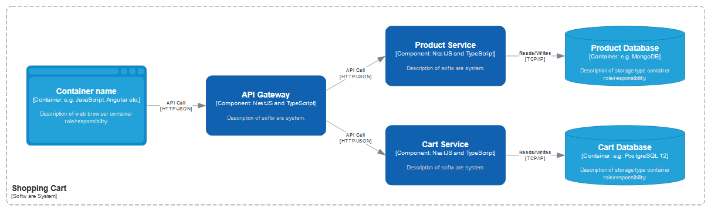

# kk-shopping-cart

The shopping cart main repository.

- [Setup](#setup)
- [How to run on local environment](#how-to-run-on-local-environment)
  - [APIs documentation](#apis-documentation)
- [Requirements](#requirements)
- [Architecture design](#architecture-design)
- [Pending points](#pending-points)

## Setup

- clone the repository with the command below:

```bash
git clone https://github.com/buemura/kk-shopping-cart.git
```

## How to run on local environment

- To run on local environment you will need to have `node`, `docker` and `docker-compose` installed.

1. Make sure to have the `.env` on root of all applications inside `apps/` directory.

2. To start all the required databases

- You can execute the script below to start an instance of mongodb and postgresql:

```bash
pnpm run docker:up
```

- Then install all the dependencies:

```bash
pnpm install
```

- And finally seed the `product-service` database by using the command below:

```bash
cd apps/product-service
pnpm seed:dev
```

3. To stop apps and local databases

- You can execute the script below to stop the mongodb and postgresql:

```bash
npm run docker:down
```

### APIs documentation

- backend:
  - With application running, go to `http://localhost:8080/api/docs` to see the Swagger documentation.
- product-service:
  - With application running, go to `http://localhost:8081/api/docs` to see the Swagger documentation.
- cart-service:
  - With application running, go to `http://localhost:8082/api/docs` to see the Swagger documentation.

## Requirements

Development of three services. The communication between the services can be done through HTTP:

- Development of a REST API:

  - Endpoint that returns a list of products. This products must be retrieved from the `products-service`.

    - Structure example:

    ```json
    {
      "productId": "192663",
      "price": 267
    }
    ```

  - Endpoint to add a product to a cart. It must communicate with `carts-service`.
  - Endpoint to remove a remove a product from a cart. It must communicate with `carts-service`.
  - Endpoint to get cart. It must communicate with `carts-service`.
  - Cart response example:
    ```json
    {
      "shoppingCartId": "192663",
      "userId": "11111111",
      "totalPrice": 267,
      "totalQuantity": 1,
      "products": [
        {
          "productId": "192663",
          "price": 267,
          "quantity": 1
        }
      ]
    }
    ```

- Development of a microservice for products
  - Should integrate with a NoSQL database to get products.
- Development of a microservice for shopping cart
  - Should integrate with a SQL database to persist shopping carts.

## Architecture design



## Pending points

- Implementation of a better test suite.
- Implementation of authentication feature
- Refactor services to be more decoupled
